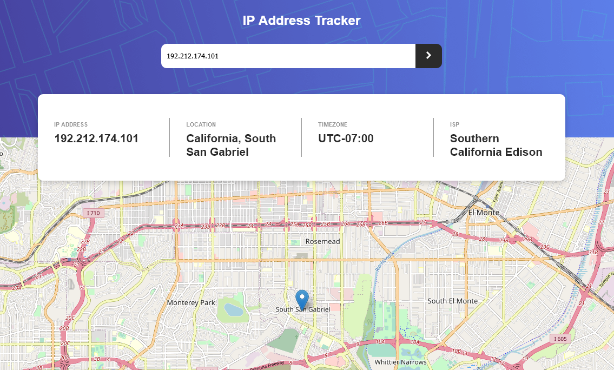

# Frontend Mentor - IP address tracker solution

This is a solution to the [IP address tracker challenge on Frontend Mentor](https://www.frontendmentor.io/challenges/ip-address-tracker-I8-0yYAH0). Frontend Mentor challenges help you improve your coding skills by building realistic projects. 


### The challenge

Users should be able to:

- View the optimal layout for each page depending on their device's screen size
- See hover states for all interactive elements on the page
- See their own IP address on the map on the initial page load
- Search for any IP addresses or domains and see the key information and location

### Screenshot




### Built with

- Semantic HTML5 markup
- CSS custom properties
- Flexbox
- [React](https://reactjs.org/) - JS library
- [leaflet.js](https://leafletjs.com/) - interactive maps framework
- [react-leaflet.js](https://react-leaflet.js.org/) - React components for Leaflet

### What I learned
- How to use Leaflet (easy to use/ great performance)

```javascript
 <MapContainer
      style={{ height: "100vh" }}
      center={props.positionNum} zoom={13}>
      <ChangeView center={props.positionNum} />
      <TileLayer
        attribution='&copy; <a href="https://www.openstreetmap.org/copyright">OpenStreetMap</a> contributors'
        url="https://{s}.tile.openstreetmap.org/{z}/{x}/{y}.png"
      />
      <Marker position={props.positionNum}>
        <Popup>
          Your Approximate location
        </Popup>
      </Marker>
    </MapContainer>
```

### Useful resources

- [Leaflet Quick Start Guide](https://leafletjs.com/SlavaUkraini/examples/quick-start/) - This simple step-by-step guide helped me with the basics of leaflet.
- [react-Leaflet](https://react-leaflet.js.org/docs/start-introduction/) - This guided me through how to use leaflet in react.


